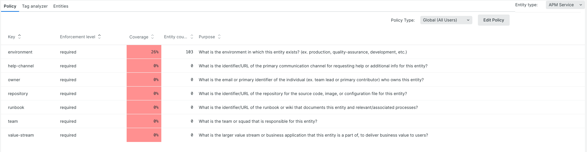
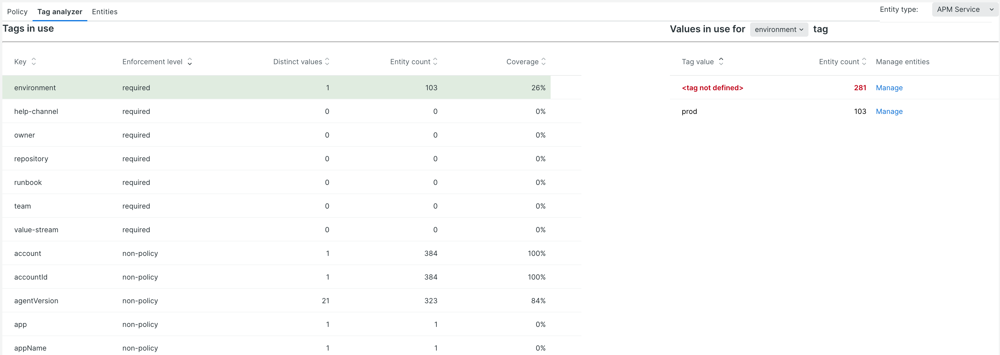
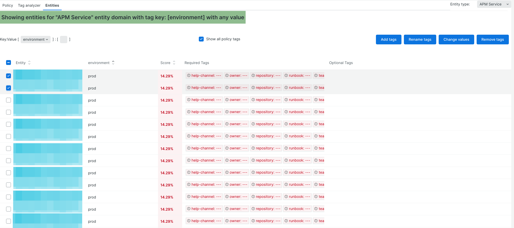

[](https://opensource.newrelic.com/oss-category/#new-relic-one-catalog-project)

# nr1-tag-improver
  [](https://snyk.io/test/github/newrelic/nr1-tag-improver)

<a href="https://github.com/newrelic?q=nrlabs-viz&amp;type=all&amp;language=&amp;sort="></a>

This application is maintained by the New Relic Labs team. Connect with us directly by [creating issues](../../issues) or [starting a discussion](../../discussions) in this repo.

## About this Nerdpack

Tag Improver is here to help you get maximum value from New Relic One by simplifying the process of creating and managing a good tagging strategy.

Define the important entity tags for your environment, report on coverage, and view overall tag usage across everything you own.

## What can Tag Improver do for you

### Report on the coverage of key tags across your portfolio based on an editable tag schema

Tag Improver introduces the concept of “tag policies” which define a set of tags and their enforcement level within an account. Users can specify whether a tag is Required or Optional. Only tags that are identified as Required will be considered when assessing tag policy compliance. As a convenience, we provide you with a default tag policy on deployment of Tag Improver that you may edit to better fit and drive your organization’s tagging strategy.



### Explore the full set of tag key:values in use across your account

In the Tag Analyzer tab, users can view and analyze all of the tags currently in use for a given entity type in their selected account(s), including those defined in the tag policy but not currently defined for any entities. Tag Analyzer displays all tags in use across the entities of a specific entity type, not just those defined in the tag policy, providing a consolidated and complete view.

With the v1.1 release, users can now seamlessly move from identifying a cohort of entities with a particular value for a tag (or no value at all if undefined) in the Tag Analyzer tab and then operate on those entities in the Entities tab. This new and convenient workflow makes closing coverage gaps and enforcing an organization’s tag policy easy. Some of the other benefits & improvements include:

- Identifying high-cardinality tags and inspecting for duplicate or redundant values
- Identifying and managing duplicate or redundant tag keys (ex. “Environment” vs. “environment”)
- Identifying non-policy tags with high coverage to incorporate into the tag policy



### Report the tags in use (and missing) from each entity, and manually manage tags in bulk

In the Policy tab, you can define a policy for tag governance across your account. In the Tag Analyzer tab, you can view adherence to that coverage and values in use. In the Entities tab, it all comes together. As the name indicates, the Entities tab provides an entity-centric view of tags and tag policy coverage, along with the ability to add, modify, or remove tags or values on those entities.



## Caveats

As with anything, a few caveats:

Tag Improver currently does not recognize the mutability of tags. Attempts to add or edit an immutable tag will result in creating a new tag key but scoped to the user. A future release of Tag Improver is planned to address and remedy this behavior.
A manual refresh Tag Improver may be needed to reflect some changes implemented (bulk edit actions)
Tag Improver, like many Nerdpacks, employs Nerdstore for storage needs; at this time, tag policies are user-scoped. This limitation will be addressed in a future release of Tag Improver or other tag management functionality in NR1.

## Open source license

This project is distributed under the [Apache 2 license](LICENSE).

## What do you need to make this work?

Access to New Relic One and a Full Stack Observability subscription.

Editing tags requires a User-level account.

## Getting started

1. Ensure that you have [Git](https://git-scm.com/book/en/v2/Getting-Started-Installing-Git) and [NPM](https://www.npmjs.com/get-npm) installed. If you're unsure whether you have one or both of them installed, run the following commands. (If you have them installed, these commands return a version number; if not, the commands aren't recognized.)
```bash
git --version
npm -v
```
2. Install the [NR1 CLI](https://one.newrelic.com/launcher/developer-center.launcher) by going to [the developer center](https://one.newrelic.com/launcher/developer-center.launcher), and following the instructions to install and set up your New Relic development environment. This should take about 5 minutes.
3. Execute the following command to clone this repository and run the code locally against your New Relic data:

```bash
nr1 nerdpack:clone -r https://github.com/newrelic/nr1-tag-improver.git
cd nr1-tag-improver
nr1 nerdpack:uuid -gf
npm install
nr1 nerdpack:serve
```

Visit [https://one.newrelic.com/?nerdpacks=local](https://one.newrelic.com/?nerdpacks=local) to run the app locally.

## Deploying this Nerdpack

Open a command prompt in the app's directory and run the following commands.

```bash
# If you need to create a new uuid for the account to which you're deploying this app, use the following
# nr1 nerdpack:uuid -g [--profile=your_profile_name]
# to see a list of APIkeys / profiles available in your development environment, run nr1 credentials:list
nr1 nerdpack:publish [--profile=your_profile_name]
nr1 nerdpack:deploy [-c [DEV|BETA|STABLE]] [--profile=your_profile_name]
nr1 nerdpack:subscribe [-c [DEV|BETA|STABLE]] [--profile=your_profile_name]
```

Visit [https://one.newrelic.com](https://one.newrelic.com), and launch your app in New Relic.

## Community Support

The discussions page on this repository is enabled for customers to interact with New Relic employees as well as other customers to get help and share best practices. You can check out the discussions page for this repo [here](../../discussions).

You can also interact with us and other customers to troubleshoot issues and share best practices on [New Relic Explorers Hub](https://discuss.newrelic.com).

## Issues / Enhancement Requests

Issues and enhancement requests can be submitted in the [Issues tab of this repository](../../issues). Please search for and review the existing open issues before submitting a new issue.

## Security

As noted in our [security policy](https://github.com/newrelic/nr1-tag-improver/security/policy), New Relic is committed to the privacy and security of our customers and their data. We believe that providing coordinated disclosure by security researchers and engaging with the security community are important means to achieve our security goals.

If you believe you have found a security vulnerability in this project or any of New Relic's products or websites, we welcome and greatly appreciate you reporting it to New Relic through [HackerOne](https://hackerone.com/newrelic).

# Contributing

Contributions are encouraged! If you submit an enhancement request, we'll invite you to contribute the change yourself. Please review our [Contributors Guide](CONTRIBUTING.md).

Keep in mind that when you submit your pull request, you'll need to sign the CLA via the click-through using CLA-Assistant. If you'd like to execute our corporate CLA, or if you have any questions, please drop us an email at opensource+nr1-tag-imporover@newrelic.com.

## Customizing the Tag Policy

Users can edit the tagging policy in the New Relic One UI but those changes are only visible to the individual user. To customize the default policy, follow these instructions before deploying the app to your account(s).

The Policy report is driven by a policy schema defined in [tag-schema.js](./nerdlets/tag-improver-nerdlet/tag-schema.js)

First, define the set of required and optional tags for your environment.
Edit [tag-schema.js](./nerdlets/tag-improver-nerdlet/tag-schema.js) to reflect your policy.

Each object in the schema JSON should have:

* `key` - the actual tag key as applied to entities in New Relic
* `enforcement` - the schema enforcement level from `TAG_SCHEMA_ENFORCEMENT` (controls presentation on Overview tab)
* `label` - human-readable name of the tag, generally the same or a more verbose version of `key`
* `purpose` - optional, more detailed description of usage or provenance for the tag value

When done, follow the instructions above under **Deploying this Nerdpack** to deploy your changes to your account.
