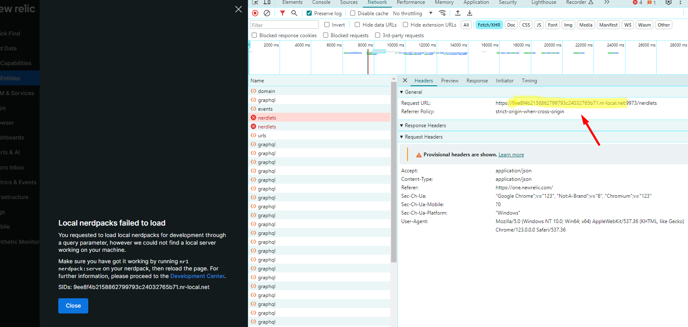

# Customizing the Tag Policy
Users can edit the tagging policy in the New Relic UI but those changes are only visible to the individual user. To customize the default policy, follow these instructions before deploying the app to your account(s).

The Policy report is driven by a policy schema defined in tag-schema.js

First, define the set of required and optional tags for your environment. Edit tag-schema.js to reflect your policy.

Each object in the schema JSON should have:

* key - the actual tag key as applied to entities in New Relic
* enforcement - the schema enforcement level from TAG_SCHEMA_ENFORCEMENT (controls presentation on Overview tab)
* label - human-readable name of the tag, generally the same or a more verbose version of key
* purpose - optional, more detailed description of usage or provenance for the tag value

When done, follow the instructions above under Enabling this App to deploy your changes to your account.

# Running the App locally 

1) Ensure you have Git and NPM install. You can check this by running below commands: 

   `git --version`   
   `npm -v`   
2) Install the [NR1](https://one.newrelic.com/developer-center?account=2592049&state=a53067c2-c37d-a653-e6e5-49ecd91eaa1c) by going to the developer center, and following the instructions to install and set up your New Relic development environment.
3) Run the code locally against your New Relic data:

    `cd landonline-nr-tag-improver`

    `nr1 nerdpack:uuid -gf`

    `npm install`

    `nr1 nerdpack:serve`

4) Visit https://one.newrelic.com/?nerdpacks=local to run the app locally. If the nerdpack fails to load add the entry point to the hostfile as below. You edit your hostfile only when run on admin permissions. The file can be found at C:\Windows\System32\drivers\hosts.

    `127.0.0.1 9ee8f4b2158862799793c24032765b71.nr-local.net`

# Deploying the Nerdpack 

Open a command prompt in the app's directory and run the following commands.

    nr1 profiles:list (should be linz-step by default and should be set at the earlier step when installing NR1)
    nr1 nerdpack:publish --profile=linz-step
    nr1 nerdpack:deploy --profile=linz-step
    nr1 nerdpack:subscribe --profile=linz-step 

Visit https://one.newrelic.com, and launch your app in New Relic.

